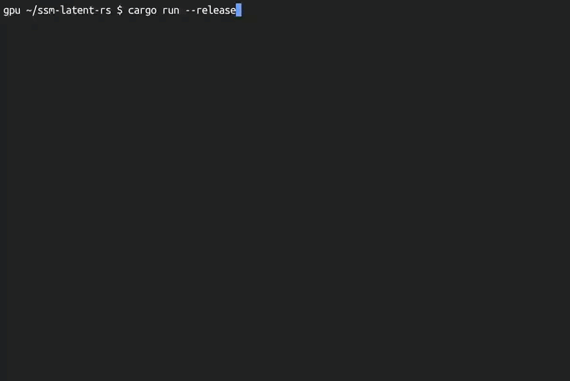

# ssm-latent-model

Rust implementation of a latent state predictor leveraging State Space Models (SSM).



## Features

- **SSM Dynamics**: Efficient sequence modeling using state space principles.
- **Latent Prediction**: Predicts future states in an embedding space.
- **Stability Regularizer**: Prevents representation collapse during training without contrastive samples.
- **Rust + Burn**: High-performance implementation supporting multiple backends (WGPU, NdArray, LibTorch, etc.).

## Installation

```bash
git clone <repository-url>
cd ssm-latent-model
cargo build
```

## Usage

Run the demonstration script:

```bash
cargo run --release
```

This demo trains a world model to predict and "imagine" the future states of a dynamical system in latent space.

## Testing

Run equivalence tests (Parallel vs Sequential):
```bash
cargo test
```

## License

MIT License
